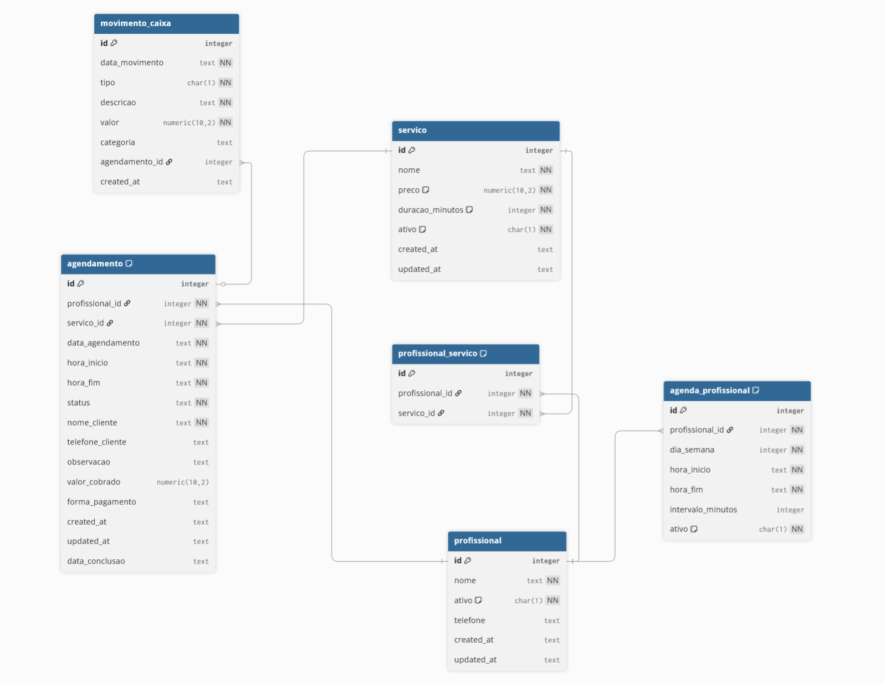

# Aula 2 — OpenCode + Framework PHP

# Objetivo da aula

Nesta aula, vamos iniciar o desenvolvimento do projeto de barbearia utilizando o framework. Teremos como objetivos:

- Preparar o ambiente de execução.
- Abrir o projeto no OpenCode.
- Analisar a arquitetura base.
- Compreender a estrutura do sistema.
- Configurar o banco de dados.
- Integrar agentes de IA.
- Preparar os primeiros módulos e formulários do sistema.

<br>

* * *

## 1\. Pré-requisitos

- Template do framework baixado na Aula 1.
- Ambiente com PHP, MySQL e Apache (==Laragon==, XAMPP ou Docker).

<br>

* * *

## 2\. Preparação do ambiente

- Descompactar o template.
- Extrair para a pasta de trabalho.
- Exemplo de caminho:

```
C:\laragon\www\barbearia_aula

```

<br>

* * *

## 3\. Abrindo o projeto

Dentro da pasta do projeto, abra o terminal e execute:

```
code .
opencode

```

<br>

* * *

## 4\. Selecionar modelo

No OpenCode:

```
/models

```

Selecionar modelo OpenAI.

* * *

## 5\. Comandos iniciais

- Explicar um arquivo:

```
@arquivo

```

- Gerar arquivo de agentes:

```
/init

```

* * *

## 6\. Análise da estrutura

```
Analise as pastas:
app/config
app/control
app/database
app/model
app/resources
app/service
Identifique padrões e praticas utilizadas.
```

<br>

* * *

## 7\. Criação do banco 

### 7.1 Configuração do banco de dados

- Utilizar SQLite como base local do projeto.
- Atualizar as credenciais no arquivo de configuração do framework.

### 7.2 Modelagem

- Diagrama ER do sistema.

### ER

<br>

<br>

- Script SQL de criação das tabelas.

### Script

```
-- Tabelas principais
CREATE TABLE profissional (
    id INTEGER PRIMARY KEY,
    nome TEXT NOT NULL,
    ativo CHAR(1) NOT NULL DEFAULT 'Y',
    telefone TEXT,
    created_at TEXT,
    updated_at TEXT
);

CREATE TABLE servico (
    id INTEGER PRIMARY KEY,
    nome TEXT NOT NULL,
    preco NUMERIC(10,2) NOT NULL DEFAULT 0,
    duracao_minutos INTEGER NOT NULL DEFAULT 0,
    ativo CHAR(1) NOT NULL DEFAULT 'Y',
    created_at TEXT,
    updated_at TEXT
);

CREATE TABLE profissional_servico (
    id INTEGER PRIMARY KEY,
    profissional_id INTEGER NOT NULL,
    servico_id INTEGER NOT NULL
);

CREATE TABLE agenda_profissional (
    id INTEGER PRIMARY KEY,
    profissional_id INTEGER NOT NULL,
    dia_semana INTEGER NOT NULL,
    hora_inicio TEXT NOT NULL,
    hora_fim TEXT NOT NULL,
    intervalo_minutos INTEGER,
    ativo CHAR(1) NOT NULL DEFAULT 'Y'
);

CREATE TABLE agendamento (
    id INTEGER PRIMARY KEY,
    profissional_id INTEGER NOT NULL,
    servico_id INTEGER NOT NULL,
    data_agendamento TEXT NOT NULL,
    hora_inicio TEXT NOT NULL,
    hora_fim TEXT NOT NULL,
    status TEXT NOT NULL,
    nome_cliente TEXT NOT NULL,
    telefone_cliente TEXT,
    observacao TEXT,
    valor_cobrado NUMERIC(10,2),
    forma_pagamento TEXT,
    created_at TEXT,
    updated_at TEXT,
    data_conclusao TEXT
);

CREATE TABLE movimento_caixa (
    id INTEGER PRIMARY KEY,
    data_movimento TEXT NOT NULL,
    tipo CHAR(1) NOT NULL,
    descricao TEXT NOT NULL,
    valor NUMERIC(10,2) NOT NULL,
    categoria TEXT,
    agendamento_id INTEGER,
    created_at TEXT
);

-- Indices
CREATE INDEX agenda_prof_dia_idx ON agenda_profissional (profissional_id, dia_semana);
CREATE INDEX profissional_servico_idx ON profissional_servico (profissional_id, servico_id);
CREATE INDEX agendamento_prof_data_idx ON agendamento (profissional_id, data_agendamento);


```

<br>

## <br>

### Descrição das tabelas

## Descrição das Tabelas

### 1\. `profissional`

Armazena os barbeiros ou atendentes.

- `id`: identificador do profissional.
- `nome`: nome do profissional.
- `ativo`: indica se está disponível para atendimento.
- `telefone`: contato.
- `created_at`, `updated_at`: controle de histórico.

**Relações:**

- Relaciona-se com `servico` por meio da tabela `profissional_servico`.
- Relaciona-se com `agenda_profissional` e `agendamento`.

* * *

### 2\. `servico`

Representa os serviços oferecidos (corte, barba, etc.).

- `preco`: valor padrão do serviço.
- `duracao_minutos`: tempo estimado.
- `ativo`: se o serviço está disponível.

**Relações:**

- Relaciona-se com `profissional` por meio de `profissional_servico`.
- Relaciona-se com `agendamento`.

* * *

### 3\. `profissional_servico`

Tabela de relacionamento **N:N** (muitos para muitos).

- Um profissional pode executar vários serviços.
- Um serviço pode ser realizado por vários profissionais.

Campos:

- `profissional_id` → `profissional.id`
- `servico_id` → `servico.id`

* * *

### 4\. `agenda_profissional`

Define quando cada profissional atende.

- `dia_semana`: 0 a 6 (domingo a sábado).
- `hora_inicio` / `hora_fim`: janela de atendimento.
- `intervalo_minutos`: tempo entre atendimentos.

**Relação:**

- Cada registro pertence a um `profissional`.

* * *

### 5\. `agendamento`

Registra cada atendimento marcado.

- Liga **profissional + serviço + data + horário**.
- Armazena dados do cliente, valor cobrado e forma de pagamento.
- `status`: Ex.: agendado, concluído, cancelado.
- `data_conclusao`: quando o atendimento foi finalizado.

**Relações:**

- `profissional_id` → `profissional.id`
- `servico_id` → `servico.id`
- Relaciona-se com `movimento_caixa`.

* * *

### 6\. `movimento_caixa`

Registra entradas e saídas financeiras.

- `tipo`: E (entrada) ou S (saída).
- `agendamento_id`: quando o movimento vem de um atendimento.

**Relação:**

- Um agendamento pode gerar um movimento no caixa.

* * *

## Relações Principais (Resumo)

- **profissional ↔ servico** → via `profissional_servico`
- **profissional ↔ agenda\_profissional** → define quando atende
- **profissional + servico ↔ agendamento** → define o atendimento
- **agendamento ↔ movimento\_caixa** → registra impacto financeiro

<br>

<br>

* * *

## 8\. Apresentação da estrutura do sistema

### Estrutura do projeto

#### Principal

- Início
- Dashboard
- Profissionais
- Serviços
- Vínculo Serviços
- Atendimentos

#### Agenda

- Agenda Profissional
- Agendamentos
- Agendar

#### Caixa

- Movimento de Caixa

<br>

* * *

## 9\. Controllers no modo tradicional (List/Form)

- Profissionais
- Serviços
- Vínculo Serviços

<br>

* * *

## 10\. Integração com OpenCode

- Alterar o arquivo **AGENTS.md** 
- Adicionar **[contexto.md](https://contexto.md "https://contexto.md")**  na raiz do projeto.

  

### AGENTS

```
# AGENTS

Este arquivo orienta agentes automaticos a contribuir com seguranca e
consistencia neste repositorio. Ele resume comandos e convencoes observadas
no codigo atual.

Escopo e estrutura
- Projeto PHP baseado no Adianti Framework (ver `lib/adianti` e `app/*`).
- Entradas principais: `index.php` (web), `engine.php` (aplicacao), `cmd.php` (CLI).
- Configuracoes em `app/config/*.php` e `app/config/*.ini`.
- Controladores em `app/control/**`.
- Modelos em `app/model/**` (Active Record Adianti).
- Servicos em `app/service/**` (CLI, REST, jobs, auth, system).
- Recursos HTML/CSS em `app/resources/**` e templates em `app/templates/**`.
- Bases sqlite e scripts SQL em `app/database/**`.
- Consulte sempre que necessario o arquivo `contexto.md` para informacoes do projeto.

Regras de agentes (Cursor/Copilot)
- Nao existem regras em `.cursor/rules/` ou `.cursorrules`.
- Nao existe `.github/copilot-instructions.md`.

Requisitos e runtime
- PHP minimo: 8.2 (ver `init.php`).
- Composer esta presente apenas com dependencias (sem scripts definidos).
- Nao ha configuracao de testes/lint no nivel do projeto.

Comandos de build, lint e testes
Observacao: este repositorio nao define comandos oficiais de build/lint/test.
Evite inventar scripts. Use o que o projeto expor explicitamente.

Instalacao de dependencias
- `composer install`

Build
- Nao ha pipeline de build definida./

Lint
- Nao ha lint configurado no projeto.

Testes
- Nao ha testes do projeto. Existem testes apenas em `vendor/**`.

Testes individuais (quando existirem)
- Nao ha estrutura de testes do app para executar individualmente.
- Se forem adicionados no futuro, documente o comando aqui.

Execucao CLI (servicos Adianti)
- Uso: `php cmd.php "class=Classe&method=metodo&param=valor"`
- Exemplo: `php cmd.php "class=SystemScheduleService&method=run"`

Execucao web
- A entrada web usa `index.php` e carrega templates conforme login/public view.

Convencoes de codigo observadas

Formato e estilo
- Chaves em nova linha (estilo Allman).
- Indentacao com 4 espacos.
- Espacos ao redor de operadores binarios.
- Separacao por linhas em branco entre blocos logicos.
- Docblocks no topo das classes e metodos importantes.

Imports e namespaces
- Classes do app nao usam namespace.
- `use` no topo do arquivo quando necessario (ex.: `ApplicationAuthenticationService`).
- Evite alias desnecessario.

Nomenclatura
- Classes em PascalCase (ex.: `SystemNotification`, `LoginForm`).
- Metodos em camelCase ou `get_*`/`set_*` quando esperado pelo framework.
- Constantes em UPPER_SNAKE com valores fixos (ex.: `TABLENAME`, `PRIMARYKEY`).
- Variaveis locais em camelCase; arrays por convencao `[ 'chave' => 'valor' ]`.

Tipos e retornos
- Nao ha tipagem estrita declarada.
- Metodos publicos geralmente nao declaram tipo de retorno.
- Ao adicionar tipos, mantenha a compatibilidade com o padrao do arquivo atual.

Tratamento de erros e transacoes
- Use `TTransaction::open()` e `TTransaction::close()` ao acessar banco.
- Em excecoes, use `TTransaction::rollback()` quando apropriado.
- Em servicos CLI, capture `Exception` e `Error` separadamente se preciso.
- Para mensagens de erro em UI, use `new TMessage('error', $e->getMessage())`.

Padroes Adianti (framework)
- Models herdam de `TRecord` e declaram `TABLENAME`, `PRIMARYKEY`, `IDPOLICY`.
- Atributos do model sao definidos via `parent::addAttribute()` no construtor.
- Controladores herdam de `TPage`.
- Permissoes e acesso sao verificados via `SystemPermission`.
- Traducao de strings via `_t('Texto')`.
- Certifique-se do arquivo translations.json ter todos as traduçoes necessarias
Configuracoes
- `app/config/application.php` concentra opcoes gerais, login, template e hooks.
- Conexoes SQLite em `app/config/*.php` (permission/log/etc).
- Evite hardcode de credenciais; siga os exemplos existentes.

Arquitetura por camadas
- Controladores coordenam UI e fluxo.
- Servicos encapsulam logica de jobs, REST, auth, system e CLI.
- Models representam tabelas do banco com Active Record.

Boas praticas ao editar
- Respeite o estilo do arquivo onde esta editando.
- Mantenha padroes de transacao consistentes.
- Use `_t()` para textos exibidos ao usuario.
- Evite alterar `vendor/**`.
- Evite criar novas dependencias sem necessidade clara.

Recursos e templates
- HTML de recursos fica em `app/resources/**`.
- Templates principais em `app/templates/adminbs5/**`.
- Na web, o layout depende do estado de login e do tema configurado.

Paginas customizadas (HTML + JS + TPage)
- Controllers de paginas customizadas ficam em `app/control/**` e devem conter `Custom` no nome (ex.: `AgendarServicoCustomForm`).
- Recursos HTML ficam em `app/resources/<dominio-do-projeto>/**` conforme o projeto (ex.: `app/resources/barbearia/agendar_servico_custom_form.html`).
- O controller deve usar `THtmlRenderer` e `enableSection('main', [...])` para injetar textos e labels.
- O HTML usa secao `<!--[main]--> <!--[/main]-->` e pode incluir CSS/JS locais para a pagina.
- JS deve consumir metodos `onGet*`/`onConfirm` via `__adianti_ajax_exec` e tratar retorno JSON.
- Padronize respostas JSON com `jsonResponse`, `Content-Type: application/json` e erro com `error`/`message`.
- Valide entradas no controller, normalize data/hora com helpers (`normalizeDate`, `normalizeTime`).
- Separe regra de negocio em `app/service/**` quando houver logica reutilizavel.
- Consulte exemplo `contexto.md` AgendamentoAdminCustomForm|AgendamentoService|agendamento_admin_custom_form

Cadastro de programas e menu (rotina obrigatoria)
- Verifique o banco de permissao configurado em `app/config/permission.php` (padrao: `app/database/permission.db`).
- Antes de usar um novo controller no app, confirme se ele existe em `system_program`.
- Se nao existir, faca a inclusao no `app/database/permission.db` seguindo o padrao de `app/database/permission.sql`.
- Atualize tambem os scripts `app/database/permission.sql` e/ou `app/database/permission-update.sql` com o novo programa.
- Ajuste `menu.xml` para incluir o item de menu correspondente, respeitando a hierarquia atual.

Seguranca e sessao
- Sessao e permissao sao tratadas por `ApplicationAuthenticationService`.
- Tokens JWT usam seed configurado em `app/config/application.php`.
- Quando validar unidades e idioma, siga o padrao de `setUnit` e `setLang`.

Observacoes sobre banco
- O projeto usa SQLite por padrao (`app/database/*.db`).
- Scripts SQL de atualizacao estao em `app/database/*-update.sql`.

Se voce adicionar testes
- Documente o comando para rodar todos e um teste unico.
- Inclua caminho e framework de teste usado.

Se voce adicionar lint/format
- Documente o comando e a configuracao (ex.: phpcs, php-cs-fixer).
- Garanta que o comando funcione no root do repositorio.

Checklist rapido para agentes
- Entender o fluxo atual e o ponto de entrada.
- Manter compatibilidade com Adianti e PHP 8.2.
- Respeitar padroes de transacao e traducao.
- Atualizar este AGENTS.md se novas regras forem criadas.


```

<br>

### CONTEXTO

```
# Sistema de Barbearia — Especificação e Estrutura (Markdown)

## Estrutura do projeto

### Principal
- Início
- Dashboard
- Profissionais
- Serviços
- Vínculo Serviços
- Atendimentos

### Agenda
- Agenda Profissional
- Agendamentos
- Agendar

### Caixa
- Movimento de Caixa

---

## 1) Escopo funcional do sistema

### Fluxo mínimo
1. Cliente acessa o sistema.  
2. Seleciona o profissional.  
3. Visualiza os serviços disponíveis do profissional (podem ser “todos” ou por vínculo profissional-serviço).  
4. Seleciona serviço, data e horário (somente horários dentro da agenda de atendimento do profissional e livres).  
5. Confirma o agendamento.  
6. Recebe um identificador do agendamento (e opcionalmente confirmação por e-mail/WhatsApp, se futuramente integrar).  

### Regras essenciais
- Um horário só pode ser escolhido se estiver dentro da janela de atendimento do dia da semana do profissional.  
- O horário precisa estar livre, considerando a duração estimada do serviço.  
- O sistema deve bloquear conflitos (dois agendamentos sobrepostos para o mesmo profissional).  

---

## 2) Modelo de dados (SQLite) recomendado

```sql
-- Tabelas principais
CREATE TABLE profissional (
    id INTEGER PRIMARY KEY,
    nome TEXT NOT NULL,
    ativo CHAR(1) NOT NULL DEFAULT 'Y',
    telefone TEXT,
    created_at TEXT,
    updated_at TEXT
);

CREATE TABLE servico (
    id INTEGER PRIMARY KEY,
    nome TEXT NOT NULL,
    preco NUMERIC(10,2) NOT NULL DEFAULT 0,
    duracao_minutos INTEGER NOT NULL DEFAULT 0,
    ativo CHAR(1) NOT NULL DEFAULT 'Y',
    created_at TEXT,
    updated_at TEXT
);

CREATE TABLE profissional_servico (
    id INTEGER PRIMARY KEY,
    profissional_id INTEGER NOT NULL,
    servico_id INTEGER NOT NULL
);

CREATE TABLE agenda_profissional (
    id INTEGER PRIMARY KEY,
    profissional_id INTEGER NOT NULL,
    dia_semana INTEGER NOT NULL,
    hora_inicio TEXT NOT NULL,
    hora_fim TEXT NOT NULL,
    intervalo_minutos INTEGER,
    ativo CHAR(1) NOT NULL DEFAULT 'Y'
);

CREATE TABLE agendamento (
    id INTEGER PRIMARY KEY,
    profissional_id INTEGER NOT NULL,
    servico_id INTEGER NOT NULL,
    data_agendamento TEXT NOT NULL,
    hora_inicio TEXT NOT NULL,
    hora_fim TEXT NOT NULL,
    status TEXT NOT NULL,
    nome_cliente TEXT NOT NULL,
    telefone_cliente TEXT,
    observacao TEXT,
    valor_cobrado NUMERIC(10,2),
    forma_pagamento TEXT,
    created_at TEXT,
    updated_at TEXT,
    data_conclusao TEXT
);

CREATE TABLE movimento_caixa (
    id INTEGER PRIMARY KEY,
    data_movimento TEXT NOT NULL,
    tipo CHAR(1) NOT NULL,
    descricao TEXT NOT NULL,
    valor NUMERIC(10,2) NOT NULL,
    categoria TEXT,
    agendamento_id INTEGER,
    created_at TEXT
);

-- Indices
CREATE INDEX agenda_prof_dia_idx ON agenda_profissional (profissional_id, dia_semana);
CREATE INDEX profissional_servico_idx ON profissional_servico (profissional_id, servico_id);
CREATE INDEX agendamento_prof_data_idx ON agendamento (profissional_id, data_agendamento);
````

### Persistência

* Criar banco: `app/database/barbearia.db`
* Criar conexão: `app/config/barbearia.php`
* Vamos utilizar todos os formulários do projeto em modo custom

---

## 3) Cores do sistema

| Função              | Cor | Hex       |
| ------------------- | --- | --------- |
| Preto carvão (base) | ⬛   | `#121212` |
| Marrom café         | 🟤  | `#4A2C2A` |
| Dourado envelhecido | 🟨  | `#C9A24D` |
| Bege claro          | 🤍  | `#E6DCCB` |
| Cinza aço           | ⚙️  | `#6E6E6E` |

---

## Exemplo de criação do Formulário customizado

### `AgendamentoAdminCustomForm.php`

```php
<?php
class AgendamentoAdminCustomForm extends TPage
{
    protected $html;

    private const DB = 'barbearia';

    public function __construct($param = null)
    {
        parent::__construct();

        if (!empty($param['target_container']))
        {
            $this->adianti_target_container = $param['target_container'];
        }

        $this->html = new THtmlRenderer('app/resources/barbearia/agendamento_admin_custom_form.html');
        $this->html->enableSection('main', [
            'page_title' => _t('Appointments'),
            'page_subtitle' => _t('Manage barbershop appointments.'),
            'label_profissional' => _t('Professional'),
            'label_servico' => _t('Service'),
            'label_data' => _t('Date'),
            'label_hora' => _t('Start time'),
            'label_status' => _t('Status'),
            'label_cliente' => _t('Client'),
            'label_telefone' => _t('Phone'),
            'label_valor' => _t('Amount'),
            'label_pagamento' => _t('Payment method'),
            'label_observacao' => _t('Notes'),
            'btn_save' => _t('Save'),
            'btn_clear' => _t('Clear'),
        ]);

        $panel = new TPanelGroup(_t('Appointments'));
        $panel->add($this->html);

        $vbox = new TVBox;
        $vbox->style = 'width: 100%';
        $vbox->add($panel);

        parent::add($vbox);
    }

    public static function onGetProfissionais($param)
    {
        try
        {
            TTransaction::open(self::DB);

            $criteria = new TCriteria;
            $criteria->setProperty('order', 'nome asc');
            $criteria->add(new TFilter('ativo', '=', 'Y'));

            $repository = new TRepository('Profissional');
            $rows = $repository->load($criteria, false);

            $data = [];
            if ($rows)
            {
                foreach ($rows as $row)
                {
                    $data[] = [
                        'id' => (int) $row->id,
                        'nome' => (string) $row->nome
                    ];
                }
            }

            TTransaction::close();

            self::jsonResponse($data);
        }
        catch (Exception $e)
        {
            TTransaction::rollback();
            self::jsonResponse(['error' => true, 'message' => $e->getMessage()]);
        }
    }

    public static function onGetServicos($param)
    {
        try
        {
            $profissionalId = (int) ($param['profissional_id'] ?? 0);

            TTransaction::open(self::DB);

            if ($profissionalId > 0)
            {
                $servicos = AgendamentoService::getServicosByProfissional($profissionalId, true);
            }
            else
            {
                $criteria = new TCriteria;
                $criteria->add(new TFilter('ativo', '=', 'Y'));
                $criteria->setProperty('order', 'nome asc');
                $repo = new TRepository('Servico');
                $servicos = $repo->load($criteria, false) ?: [];
            }

            $data = [];
            foreach ($servicos as $servico)
            {
                $data[] = [
                    'id' => (int) $servico->id,
                    'nome' => (string) $servico->nome,
                    'preco' => (float) ($servico->preco ?? 0),
                    'duracao_minutos' => (int) ($servico->duracao_minutos ?? 0)
                ];
            }

            TTransaction::close();

            self::jsonResponse($data);
        }
        catch (Exception $e)
        {
            TTransaction::rollback();
            self::jsonResponse(['error' => true, 'message' => $e->getMessage()]);
        }
    }

    public static function onGetState($param)
    {
        try
        {
            TTransaction::open(self::DB);

            $data = self::loadRows($param);

            TTransaction::close();

            self::jsonResponse($data);
        }
        catch (Exception $e)
        {
            TTransaction::rollback();
            self::jsonResponse(['error' => true, 'message' => $e->getMessage()]);
        }
    }

    public static function onGetHorarios($param)
    {
        try
        {
            $profissionalId = (int) ($param['profissional_id'] ?? 0);
            $servicoId = (int) ($param['servico_id'] ?? 0);
            $data = trim((string) ($param['data'] ?? ''));
            $ignoreId = (int) ($param['ignore_id'] ?? 0);

            $data = Agendamento::normalizeDate($data);
            if ($profissionalId <= 0 || $servicoId <= 0 || $data === '')
            {
                self::jsonResponse(['slots' => []]);
            }

            TTransaction::open(self::DB);

            $slots = AgendamentoService::listarHorariosDisponiveis($profissionalId, $servicoId, $data, $ignoreId > 0 ? $ignoreId : null);

            TTransaction::close();

            self::jsonResponse(['slots' => $slots]);
        }
        catch (Exception $e)
        {
            TTransaction::rollback();
            self::jsonResponse(['error' => true, 'message' => $e->getMessage()]);
        }
    }

    public static function onUpsert($param)
    {
        try
        {
            $payload = self::getPayload($param);

            $id = (int) ($payload['id'] ?? 0);
            $profissionalId = (int) ($payload['profissional_id'] ?? 0);
            $servicoId = (int) ($payload['servico_id'] ?? 0);
            $data = trim((string) ($payload['data'] ?? ''));
            $data = Agendamento::normalizeDate($data);
            $horaInicio = trim((string) ($payload['hora_inicio'] ?? ''));
            $status = trim((string) ($payload['status'] ?? 'Agendado'));
            $nomeCliente = trim((string) ($payload['nome_cliente'] ?? ''));
            $telefoneCliente = trim((string) ($payload['telefone_cliente'] ?? ''));
            $observacao = trim((string) ($payload['observacao'] ?? ''));
            $valorCobrado = (string) ($payload['valor_cobrado'] ?? '');
            $formaPagamento = trim((string) ($payload['forma_pagamento'] ?? ''));

            if ($profissionalId <= 0)
            {
                throw new RuntimeException('Selecione o profissional.');
            }
            if ($servicoId <= 0)
            {
                throw new RuntimeException('Selecione o servico.');
            }
            if ($data === '')
            {
                throw new RuntimeException('Informe a data.');
            }
            if ($horaInicio === '')
            {
                throw new RuntimeException('Informe o horario.');
            }
            if ($nomeCliente === '')
            {
                throw new RuntimeException('Informe o nome do cliente.');
            }

            TTransaction::open(self::DB);

            if ($id > 0)
            {
                $existente = new Agendamento($id);
                if (strtolower((string) $existente->status) === 'concluido')
                {
                    throw new RuntimeException('Agendamento concluido nao pode ser editado.');
                }
            }

            $servico = new Servico($servicoId);
            $duracao = (int) ($servico->duracao_minutos ?? 0);
            if ($duracao <= 0)
            {
                throw new RuntimeException('Duracao do servico invalida.');
            }

            $horaFim = Agendamento::calcularHoraFim($horaInicio, $duracao);

            if (!self::horarioDentroAgenda($profissionalId, $data, $horaInicio, $horaFim))
            {
                throw new RuntimeException('Horario fora da agenda do profissional.');
            }

            if (!AgendamentoService::validarDisponibilidade($profissionalId, $data, $horaInicio, $horaFim, $id > 0 ? $id : null))
            {
                throw new RuntimeException('Conflito de horario para este profissional.');
            }

            $object = $id > 0 ? new Agendamento($id) : new Agendamento;
            $object->profissional_id = $profissionalId;
            $object->servico_id = $servicoId;
            $object->data_agendamento = $data;
            $object->hora_inicio = Agendamento::normalizeTime($horaInicio);
            $object->hora_fim = Agendamento::normalizeTime($horaFim);
            $object->status = $status !== '' ? $status : 'Agendado';
            $object->nome_cliente = $nomeCliente;
            $object->telefone_cliente = $telefoneCliente;
            $object->observacao = $observacao;
            $object->valor_cobrado = ($valorCobrado !== '') ? (float) $valorCobrado : (float) ($servico->preco ?? 0);
            $object->forma_pagamento = $formaPagamento;
            $object->updated_at = date('Y-m-d H:i:s');
            if ($id <= 0)
            {
                $object->created_at = date('Y-m-d H:i:s');
            }
            $object->store();

            if (strtolower($object->status) === 'concluido')
            {
                self::gerarMovimentoCaixa($object);
            }

            $dataRows = self::loadRows(array_merge($param, $payload));

            TTransaction::close();

            self::jsonResponse([
                'success' => true,
                'rows' => $dataRows['rows'],
                'total' => $dataRows['total'],
                'page' => $dataRows['page'],
                'per_page' => $dataRows['per_page'],
                'message' => 'Agendamento salvo.'
            ]);
        }
        catch (Exception $e)
        {
            TTransaction::rollback();
            self::jsonResponse(['error' => true, 'message' => $e->getMessage()]);
        }
    }

    public static function onDelete($param)
    {
        try
        {
            $id = (int) ($param['id'] ?? 0);
            if ($id <= 0)
            {
                throw new RuntimeException('Registro invalido.');
            }

            TTransaction::open(self::DB);

            $object = new Agendamento($id);
            $object->delete();

            $dataRows = self::loadRows($param);

            TTransaction::close();

            self::jsonResponse([
                'success' => true,
                'rows' => $dataRows['rows'],
                'total' => $dataRows['total'],
                'page' => $dataRows['page'],
                'per_page' => $dataRows['per_page'],
                'message' => 'Agendamento removido.'
            ]);
        }
        catch (Exception $e)
        {
            TTransaction::rollback();
            self::jsonResponse(['error' => true, 'message' => $e->getMessage()]);
        }
    }

    public static function onCancel($param)
    {
        try
        {
            $id = (int) ($param['id'] ?? 0);
            if ($id <= 0)
            {
                throw new RuntimeException('Registro invalido.');
            }

            TTransaction::open(self::DB);

            $agendamento = new Agendamento($id);
            if (strtolower((string) $agendamento->status) === 'concluido')
            {
                throw new RuntimeException('Agendamento concluido nao pode ser cancelado.');
            }

            $agendamento->status = 'Cancelado';
            $agendamento->forma_pagamento = null;
            $agendamento->data_conclusao = null;
            $agendamento->updated_at = date('Y-m-d H:i:s');
            $agendamento->store();

            $dataRows = self::loadRows($param);

            TTransaction::close();

            self::jsonResponse([
                'success' => true,
                'rows' => $dataRows['rows'],
                'total' => $dataRows['total'],
                'page' => $dataRows['page'],
                'per_page' => $dataRows['per_page'],
                'message' => 'Agendamento cancelado.'
            ]);
        }
        catch (Exception $e)
        {
            TTransaction::rollback();
            self::jsonResponse(['error' => true, 'message' => $e->getMessage()]);
        }
    }

    public static function onConcluir($param)
    {
        try
        {
            $payload = self::getPayload($param);

            $id = (int) ($payload['id'] ?? 0);
            $forma = trim((string) ($payload['forma_pagamento'] ?? ''));

            if ($id <= 0)
            {
                throw new RuntimeException('Registro invalido.');
            }

            $formasValidas = ['Pix', 'Dinheiro', 'Cartao'];
            if (!in_array($forma, $formasValidas, true))
            {
                throw new RuntimeException('Forma de pagamento invalida.');
            }

            TTransaction::open(self::DB);

            $agendamento = new Agendamento($id);
            $statusAtual = strtolower((string) $agendamento->status);
            $permitidos = ['agendado', 'confirmado', 'em atendimento'];
            if (!in_array($statusAtual, $permitidos, true))
            {
                throw new RuntimeException('Status nao permite concluir.');
            }

            $agendamento->status = 'Concluido';
            $agendamento->forma_pagamento = $forma;
            $agendamento->data_conclusao = date('Y-m-d H:i:s');
            $agendamento->updated_at = date('Y-m-d H:i:s');
            $agendamento->store();

            self::gerarMovimentoCaixa($agendamento);

            $dataRows = self::loadRows(array_merge($param, $payload));

            TTransaction::close();

            self::jsonResponse([
                'success' => true,
                'rows' => $dataRows['rows'],
                'total' => $dataRows['total'],
                'page' => $dataRows['page'],
                'per_page' => $dataRows['per_page'],
                'message' => 'Agendamento concluido.'
            ]);
        }
        catch (Exception $e)
        {
            TTransaction::rollback();
            self::jsonResponse(['error' => true, 'message' => $e->getMessage()]);
        }
    }

    private static function horarioDentroAgenda(int $profissionalId, string $data, string $horaInicio, string $horaFim): bool
    {
        $diaSemana = (int) date('w', strtotime($data));
        $criteria = new TCriteria;
        $criteria->add(new TFilter('profissional_id', '=', $profissionalId));
        $criteria->add(new TFilter('dia_semana', '=', $diaSemana));
        $criteria->add(new TFilter('ativo', '=', 'Y'));

        $repo = new TRepository('AgendaProfissional');
        $agendas = $repo->load($criteria, false);

        if (!$agendas)
        {
            return false;
        }

        $inicio = self::timeToMinutes(Agendamento::normalizeTime($horaInicio));
        $fim = self::timeToMinutes(Agendamento::normalizeTime($horaFim));

        foreach ($agendas as $agenda)
        {
            $iniAgenda = self::timeToMinutes(Agendamento::normalizeTime($agenda->hora_inicio));
            $fimAgenda = self::timeToMinutes(Agendamento::normalizeTime($agenda->hora_fim));
            if ($inicio >= $iniAgenda && $fim <= $fimAgenda)
            {
                return true;
            }
        }

        return false;
    }

    private static function gerarMovimentoCaixa(Agendamento $agendamento): void
    {
        $criteria = new TCriteria;
        $criteria->add(new TFilter('agendamento_id', '=', $agendamento->id));
        $repo = new TRepository('MovimentoCaixa');
        if ($repo->count($criteria) > 0)
        {
            return;
        }

        $mov = new MovimentoCaixa;
        $mov->data_movimento = $agendamento->data_conclusao ?: $agendamento->data_agendamento;
        $mov->tipo = 'E';
        $mov->descricao = 'Agendamento #' . $agendamento->id;
        $mov->valor = (float) ($agendamento->valor_cobrado ?? 0);
        $mov->categoria = 'Agendamento';
        $mov->agendamento_id = $agendamento->id;
        $mov->created_at = date('Y-m-d H:i:s');
        $mov->store();
    }

    private static function timeToMinutes(string $value): int
    {
        $value = Agendamento::normalizeTime($value);
        $parts = explode(':', $value);
        $h = (int) ($parts[0] ?? 0);
        $m = (int) ($parts[1] ?? 0);
        $s = (int) ($parts[2] ?? 0);
        return ($h * 60) + $m + (int) floor($s / 60);
    }

    private static function loadRows(array $param): array
    {
        $filters = self::resolveListParams($param);
        $criteria = self::buildListCriteria($filters);

        $repository = new TRepository('Agendamento');
        $total = $repository->count(clone $criteria);

        $criteria = self::buildListCriteria($filters);
        $criteria->setProperty('order', "case status when 'Agendado' then 0 when 'Confirmado' then 1 when 'Em atendimento' then 2 when 'Concluido' then 3 when 'Cancelado' then 4 else 5 end, data_agendamento asc, hora_inicio asc");
        $criteria->setProperty('limit', $filters['per_page']);
        $criteria->setProperty('offset', ($filters['page'] - 1) * $filters['per_page']);

        $rows = $repository->load($criteria, false);

        $profRepo = new TRepository('Profissional');
        $servRepo = new TRepository('Servico');
        $profList = $profRepo->load(new TCriteria, false);
        $servList = $servRepo->load(new TCriteria, false);

        $profMap = [];
        if ($profList)
        {
            foreach ($profList as $prof)
            {
                $profMap[$prof->id] = $prof->nome;
            }
        }

        $servMap = [];
        if ($servList)
        {
            foreach ($servList as $serv)
            {
                $servMap[$serv->id] = $serv->nome;
            }
        }

        $data = [];
        if ($rows)
        {
            foreach ($rows as $row)
            {
                $data[] = [
                    'id' => (int) $row->id,
                    'profissional_id' => (int) $row->profissional_id,
                    'servico_id' => (int) $row->servico_id,
                    'profissional' => (string) ($profMap[$row->profissional_id] ?? ''),
                    'servico' => (string) ($servMap[$row->servico_id] ?? ''),
                    'data' => (string) $row->data_agendamento,
                    'data_formatada' => self::formatDate($row->data_agendamento),
                    'data_conclusao' => (string) $row->data_conclusao,
                    'data_conclusao_formatada' => self::formatDateTime($row->data_conclusao),
                    'hora_inicio' => (string) $row->hora_inicio,
                    'hora_fim' => (string) $row->hora_fim,
                    'status' => (string) $row->status,
                    'nome_cliente' => (string) $row->nome_cliente,
                    'telefone_cliente' => (string) $row->telefone_cliente,
                    'observacao' => (string) $row->observacao,
                    'valor_cobrado' => (float) ($row->valor_cobrado ?? 0),
                    'forma_pagamento' => (string) $row->forma_pagamento
                ];
            }
        }

        return [
            'rows' => $data,
            'total' => $total,
            'page' => $filters['page'],
            'per_page' => $filters['per_page'],
            'filters' => [
                'profissional_id' => $filters['profissional_id'],
                'data' => $filters['data']
            ]
        ];
    }

    private static function resolveListParams(array $param): array
    {
        $profissionalId = (int) ($param['profissional_id_list'] ?? $param['profissional_id'] ?? 0);
        $data = trim((string) ($param['data_list'] ?? $param['data'] ?? ''));
        $data = Agendamento::normalizeDate($data);
        if ($data === '')
        {
            $data = date('Y-m-d');
        }

        $page = max(1, (int) ($param['page'] ?? 1));
        $perPage = (int) ($param['per_page'] ?? 12);
        if ($perPage <= 0)
        {
            $perPage = 12;
        }

        return [
            'profissional_id' => $profissionalId,
            'data' => $data,
            'page' => $page,
            'per_page' => $perPage
        ];
    }

    private static function buildListCriteria(array $filters): TCriteria
    {
        $criteria = new TCriteria;
        $criteria->add(new TFilter('data_agendamento', '=', $filters['data']));
        if (!empty($filters['profissional_id']))
        {
            $criteria->add(new TFilter('profissional_id', '=', $filters['profissional_id']));
        }

        return $criteria;
    }

    private static function getPayload(array $param): array
    {
        $payloadJson = (string) ($param['payload_json'] ?? '{}');
        $payload = json_decode($payloadJson, true);
        if (!is_array($payload))
        {
            throw new RuntimeException('Payload invalido.');
        }

        return $payload;
    }

    private static function formatDate(?string $value): string
    {
        $value = (string) $value;
        if ($value === '')
        {
            return '-';
        }

        $time = strtotime($value);
        if ($time === false)
        {
            return $value;
        }

        return date('d/m/Y', $time);
    }

    private static function formatDateTime(?string $value): string
    {
        $value = (string) $value;
        if ($value === '')
        {
            return '-';
        }

        $time = strtotime($value);
        if ($time === false)
        {
            return $value;
        }

        return date('d/m/Y H:i', $time);
    }

    private static function jsonResponse($data, int $statusCode = 200): void
    {
        http_response_code($statusCode);
        header('Content-Type: application/json; charset=utf-8');
        echo json_encode($data, JSON_UNESCAPED_UNICODE | JSON_UNESCAPED_SLASHES);
        exit;
    }
}
```

---

### `AgendamentoService.php`

```php
<?php
/**
 * AgendamentoService
 *
 * @version    8.3
 * @package    service
 */
class AgendamentoService
{
    public static function listarHorariosDisponiveis(int $profissionalId, int $servicoId, string $data, ?int $ignoreId = null): array
    {
        $data = Agendamento::normalizeDate($data);
        if ($profissionalId <= 0 || $servicoId <= 0 || trim($data) === '')
        {
            return [];
        }

        $servico = new Servico($servicoId);
        $duracao = (int) ($servico->duracao_minutos ?? 0);
        if ($duracao <= 0)
        {
            return [];
        }

        $diaSemana = (int) date('w', strtotime($data));
        $agendaCriteria = new TCriteria;
        $agendaCriteria->add(new TFilter('profissional_id', '=', $profissionalId));
        $agendaCriteria->add(new TFilter('dia_semana', '=', $diaSemana));
        $agendaCriteria->add(new TFilter('ativo', '=', 'Y'));
        $agendaCriteria->setProperty('order', 'hora_inicio asc');

        $agendaRepo = new TRepository('AgendaProfissional');
        $agendas = $agendaRepo->load($agendaCriteria, false);

        if (!$agendas)
        {
            return [];
        }

        $agCriteria = new TCriteria;
        $agCriteria->add(new TFilter('profissional_id', '=', $profissionalId));
        $agCriteria->add(new TFilter('data_agendamento', '=', $data));
        $agRepo = new TRepository('Agendamento');
        $agendamentos = $agRepo->load($agCriteria, false);

        $ocupados = [];
        if ($agendamentos)
        {
            foreach ($agendamentos as $ag)
            {
                if ($ignoreId && (int) $ag->id === (int) $ignoreId)
                {
                    continue;
                }

                $status = strtolower((string) $ag->status);
                if ($status === 'cancelado')
                {
                    continue;
                }

                $ocupados[] = [
                    self::timeToMinutes(Agendamento::normalizeTime($ag->hora_inicio)),
                    self::timeToMinutes(Agendamento::normalizeTime($ag->hora_fim))
                ];
            }
        }

        $slots = [];
        foreach ($agendas as $agenda)
        {
            $inicio = self::timeToMinutes(Agendamento::normalizeTime($agenda->hora_inicio));
            $fim = self::timeToMinutes(Agendamento::normalizeTime($agenda->hora_fim));
            $intervalo = (int) ($agenda->intervalo_minutos ?? 0);
            $passo = $duracao + max(0, $intervalo);
            if ($passo <= 0)
            {
                $passo = $duracao;
            }

            $cursor = $inicio;
            while (($cursor + $duracao) <= $fim)
            {
                $slotInicio = $cursor;
                $slotFim = $cursor + $duracao;

                if (!self::temConflito($ocupados, $slotInicio, $slotFim))
                {
                    $slots[] = [
                        'hora_inicio' => self::minutesToTime($slotInicio),
                        'hora_fim' => self::minutesToTime($slotFim)
                    ];
                }

                $cursor += $passo;
            }
        }

        return $slots;
    }

    public static function validarDisponibilidade(int $profissionalId, string $data, string $horaInicio, string $horaFim, ?int $ignoreId = null): bool
    {
        $data = Agendamento::normalizeDate($data);
        if ($data === '')
        {
            return false;
        }
        return !Agendamento::hasConflito($profissionalId, $data, $horaInicio, $horaFim, $ignoreId);
    }

    public static function getServicosByProfissional(int $profissionalId, bool $ativosOnly = true): array
    {
        $criteria = new TCriteria;
        $criteria->add(new TFilter('profissional_id', '=', $profissionalId));
        $repo = new TRepository('ProfissionalServico');
        $vinculos = $repo->load($criteria, false);

        if (!$vinculos)
        {
            return [];
        }

        $ids = [];
        foreach ($vinculos as $vinculo)
        {
            $ids[] = (int) $vinculo->servico_id;
        }

        if (!$ids)
        {
            return [];
        }

        $servicoCriteria = new TCriteria;
        $servicoCriteria->add(new TFilter('id', 'in', $ids));
        if ($ativosOnly)
        {
            $servicoCriteria->add(new TFilter('ativo', '=', 'Y'));
        }
        $servicoCriteria->setProperty('order', 'nome asc');

        $servicoRepo = new TRepository('Servico');
        return $servicoRepo->load($servicoCriteria, false) ?: [];
    }

    private static function timeToMinutes(string $value): int
    {
        $value = Agendamento::normalizeTime($value);
        $partes = explode(':', $value);
        $h = (int) ($partes[0] ?? 0);
        $m = (int) ($partes[1] ?? 0);
        $s = (int) ($partes[2] ?? 0);
        return ($h * 60) + $m + (int) floor($s / 60);
    }

    private static function minutesToTime(int $minutes): string
    {
        $h = floor($minutes / 60) % 24;
        $m = $minutes % 60;
        return sprintf('%02d:%02d:00', $h, $m);
    }

    private static function temConflito(array $ocupados, int $inicio, int $fim): bool
    {
        foreach ($ocupados as $ocupado)
        {
            $ini = (int) ($ocupado[0] ?? 0);
            $fimOcupado = (int) ($ocupado[1] ?? 0);
            if ($inicio < $fimOcupado && $fim > $ini)
            {
                return true;
            }
        }

        return false;
    }
}
```
---

agendamento_admin_custom_form.html
```

<!--[main]-->
<style>
    :root {
        --bb-bg: #ffffff;
        --bb-surface: #ffffff;
        --bb-ink: #121212;
        --bb-muted: #6E6E6E;
        --bb-border: rgba(18, 18, 18, 0.12);
        --bb-primary: #4A2C2A;
        --bb-primary-2: #121212;
        --bb-shadow: 0 18px 40px rgba(18, 18, 18, 0.18);
        --bb-radius: 18px;
    }

    .bb-page {
        padding: 18px;
        background: radial-gradient(circle at 12% 10%, #ffffff 0%, #f7f7f7 70%, rgba(18, 18, 18, 0.04) 100%);
        color: var(--bb-ink);
        font-family: 'Source Sans Pro', 'Segoe UI', sans-serif;
    }

    .bb-topbar {
        display: flex;
        justify-content: space-between;
        align-items: flex-start;
        gap: 12px;
        margin-bottom: 18px;
        flex-wrap: wrap;
    }

    .bb-title {
        margin: 0;
        font-weight: 900;
        font-size: clamp(1.6rem, 1.2rem + 1.1vw, 2.2rem);
        letter-spacing: 0.3px;
    }

    .bb-sub {
        color: var(--bb-muted);
        margin-top: 8px;
        max-width: 700px;
    }

    .bb-card {
        background: var(--bb-surface);
        border-radius: var(--bb-radius);
        border: 1px solid var(--bb-border);
        box-shadow: var(--bb-shadow);
        padding: 16px;
    }

    .bb-form {
        display: grid;
        grid-template-columns: repeat(12, 1fr);
        gap: 14px;
    }

    .bb-field {
        display: flex;
        flex-direction: column;
        gap: 6px;
    }

    .bb-label {
        font-size: 0.88rem;
        font-weight: 700;
        color: var(--bb-muted);
    }

    .bb-input {
        border-radius: 14px !important;
        height: 46px;
        border: 1px solid rgba(31, 41, 55, 0.18) !important;
        padding: 0 12px;
    }

    .bb-textarea {
        height: auto;
        min-height: 90px;
        padding: 10px 12px;
        resize: vertical;
    }

    .bb-input:focus {
        border-color: rgba(74, 44, 42, 0.6) !important;
        box-shadow: 0 0 0 0.2rem rgba(74, 44, 42, 0.18) !important;
    }

    .bb-actions {
        display: flex;
        gap: 10px;
        justify-content: flex-end;
        flex-wrap: wrap;
    }

    .bb-btn {
        height: 46px;
        border-radius: 999px !important;
        font-weight: 800;
        padding: 0 16px;
        display: inline-flex;
        align-items: center;
        gap: 8px;
        box-shadow: 0 8px 18px rgba(31, 41, 55, 0.12);
    }

    .bb-btn-primary {
        background: linear-gradient(135deg, var(--bb-primary) 0%, var(--bb-primary-2) 100%) !important;
        border: 0 !important;
        color: #fff !important;
    }

    .bb-btn-outline {
        background: #fff !important;
        border: 1px solid rgba(31, 41, 55, 0.18) !important;
    }

    .bb-table-wrap {
        margin-top: 16px;
        border-radius: 16px;
        border: 1px solid rgba(31, 41, 55, 0.12);
        overflow: hidden;
    }

    .bb-table-toolbar {
        display: flex;
        align-items: flex-end;
        justify-content: space-between;
        gap: 12px;
        flex-wrap: wrap;
        margin-top: 16px;
    }

    .bb-filter {
        display: flex;
        align-items: flex-end;
        gap: 10px;
        flex-wrap: wrap;
    }

    .bb-filter .bb-field {
        min-width: 180px;
    }

    .bb-pagination {
        display: flex;
        align-items: center;
        gap: 8px;
    }

    .bb-page-btn {
        height: 38px;
        border-radius: 999px !important;
        padding: 0 14px;
        font-weight: 700;
        border: 1px solid rgba(31, 41, 55, 0.18) !important;
        background: #fff !important;
    }

    .bb-page-info {
        font-size: 0.9rem;
        color: var(--bb-muted);
        font-weight: 700;
    }

    .bb-table thead th {
        background: rgba(201, 162, 77, 0.18);
        font-weight: 800;
        color: #1f2937;
    }

    .bb-slots {
        display: flex;
        flex-wrap: wrap;
        gap: 8px;
        margin-top: 6px;
    }

    .bb-slot {
        border-radius: 999px;
        padding: 8px 14px;
        border: 1px solid rgba(31, 41, 55, 0.18);
        background: #fff;
        cursor: pointer;
        font-weight: 700;
        transition: transform 0.15s ease, box-shadow 0.15s ease;
    }

    .bb-slot:hover {
        transform: translateY(-1px);
        box-shadow: 0 6px 14px rgba(31, 41, 55, 0.12);
    }

    .bb-slot.active {
        background: var(--bb-primary);
        color: #fff;
        border-color: var(--bb-primary);
    }

    .bb-hint {
        font-size: 0.85rem;
        color: var(--bb-muted);
        margin-top: 6px;
    }

    .bb-modal-backdrop {
        position: fixed;
        inset: 0;
        background: rgba(18, 18, 18, 0.5);
        display: none;
        align-items: center;
        justify-content: center;
        z-index: 9999;
    }

    .bb-modal {
        background: var(--bb-surface);
        border-radius: 16px;
        border: 1px solid var(--bb-border);
        box-shadow: var(--bb-shadow);
        padding: 18px;
        width: min(420px, 92vw);
    }

    .bb-modal h3 {
        margin: 0 0 12px;
        font-weight: 800;
        font-size: 1.15rem;
    }

    .bb-modal .bb-actions {
        margin-top: 14px;
    }

    @media (max-width: 767.98px) {
        .bb-page { padding: 12px; }
        .bb-form { grid-template-columns: repeat(1, 1fr); }
        .bb-field { grid-column: 1 / -1 !important; }
        .bb-actions { justify-content: stretch; }
        .bb-btn { width: 100%; justify-content: center; }
        .bb-table-toolbar { align-items: stretch; }
        .bb-filter { width: 100%; }
        .bb-pagination { width: 100%; justify-content: space-between; }
        .bb-page-btn { flex: 1; }
    }

    [data-bs-theme="dark"] .bb-page {
        background: radial-gradient(circle at 12% 18%, #1a1a1a 0%, #121212 55%, #0b0b0b 100%);
        color: #E6DCCB;
    }

    [data-bs-theme="dark"] .bb-card {
        background: #121212;
        border-color: rgba(201, 162, 77, 0.25);
        box-shadow: 0 18px 40px rgba(0, 0, 0, 0.4);
    }

    [data-bs-theme="dark"] .bb-input,
    [data-bs-theme="dark"] .bb-table-wrap {
        background: #1a1a1a;
        border-color: rgba(201, 162, 77, 0.25) !important;
        color: #E6DCCB;
    }

    [data-bs-theme="dark"] .bb-label,
    [data-bs-theme="dark"] .bb-sub {
        color: #6E6E6E;
    }

    [data-bs-theme="dark"] .bb-btn-outline {
        background: #121212 !important;
        color: #E6DCCB !important;
        border-color: rgba(201, 162, 77, 0.35) !important;
    }

    [data-bs-theme="dark"] .bb-page-btn {
        background: #121212 !important;
        color: #E6DCCB !important;
        border-color: rgba(201, 162, 77, 0.35) !important;
    }

    [data-bs-theme="dark"] .bb-page-btn:disabled {
        opacity: 0.6;
    }

    [data-bs-theme="dark"] .bb-table thead th {
        background: rgba(201, 162, 77, 0.2);
        color: #E6DCCB;
    }

    [data-bs-theme="dark"] .bb-slot {
        background: #1a1a1a;
        color: #E6DCCB;
        border-color: rgba(201, 162, 77, 0.25);
    }

    [data-bs-theme="dark"] .bb-slot.active {
        background: #4A2C2A;
        border-color: #4A2C2A;
    }

    [data-bs-theme="dark"] .bb-modal {
        background: #121212;
        border-color: rgba(201, 162, 77, 0.25);
    }
</style>

<div class="bb-page">
    <div class="bb-topbar">
        <div>
            <h1 class="bb-title">{$page_title}</h1>
            <div class="bb-sub">{$page_subtitle}</div>
        </div>
    </div>

    <div class="bb-card">
        <input type="hidden" id="bb-id" value="">
        <div class="bb-form">
            <div class="bb-field" style="grid-column: span 3;">
                <label class="bb-label">{$label_profissional}</label>
                <select id="bb-profissional" class="form-control bb-input"></select>
            </div>
            <div class="bb-field" style="grid-column: span 3;">
                <label class="bb-label">{$label_servico}</label>
                <select id="bb-servico" class="form-control bb-input"></select>
            </div>
            <div class="bb-field" style="grid-column: span 2;">
                <label class="bb-label">{$label_data}</label>
                <input id="bb-data" type="date" class="form-control bb-input">
            </div>
            <div class="bb-field" style="grid-column: span 2;">
                <label class="bb-label">{$label_hora}</label>
                <input id="bb-hora" type="text" class="form-control bb-input" placeholder="Selecione" readonly>
            </div>
            <div class="bb-field" style="grid-column: span 12;">
                <label class="bb-label">Horarios disponiveis</label>
                <div id="bb-slots" class="bb-slots"></div>
            </div>
            <div class="bb-field" style="grid-column: span 2;">
                <label class="bb-label">{$label_status}</label>
                <select id="bb-status" class="form-control bb-input">
                    <option value="Agendado">Agendado</option>
                    <option value="Confirmado">Confirmado</option>
                    <option value="Em atendimento">Em atendimento</option>
                    <option value="Concluido">Concluido</option>
                    <option value="Cancelado">Cancelado</option>
                </select>
            </div>
            <div class="bb-field" style="grid-column: span 4;">
                <label class="bb-label">{$label_cliente}</label>
                <input id="bb-cliente" type="text" class="form-control bb-input" placeholder="Nome do cliente">
            </div>
            <div class="bb-field" style="grid-column: span 3;">
                <label class="bb-label">{$label_telefone}</label>
                <input id="bb-telefone" type="text" class="form-control bb-input" placeholder="(00) 00000-0000">
            </div>
            <div class="bb-field" style="grid-column: span 2;">
                <label class="bb-label">{$label_valor}</label>
                <input id="bb-valor" type="text" inputmode="decimal" class="form-control bb-input" placeholder="0,00">
            </div>
            <div class="bb-field" style="grid-column: span 3;">
                <label class="bb-label">{$label_pagamento}</label>
                <select id="bb-pagamento" class="form-control bb-input">
                    <option value="">Selecione...</option>
                    <option value="Pix">Pix</option>
                    <option value="Dinheiro">Dinheiro</option>
                    <option value="Cartao">Cartão</option>
                </select>
            </div>
            <div class="bb-field" style="grid-column: span 12;">
                <label class="bb-label">{$label_observacao}</label>
                <textarea id="bb-observacao" class="form-control bb-input bb-textarea" rows="3" placeholder="Observacao"></textarea>
            </div>
        </div>

        <div class="bb-actions mt-3">
            <button type="button" id="bb-btn-clear" class="btn bb-btn bb-btn-outline">
                <i class="fa fa-eraser"></i> {$btn_clear}
            </button>
            <button type="button" id="bb-btn-save" class="btn bb-btn bb-btn-primary">
                <i class="fa fa-save"></i> {$btn_save}
            </button>
        </div>

        <div class="bb-table-toolbar">
            <div class="bb-filter">
                <div class="bb-field">
                    <label class="bb-label">{$label_profissional}</label>
                    <select id="bb-filter-profissional" class="form-control bb-input"></select>
                </div>
                <div class="bb-field">
                    <label class="bb-label">{$label_data}</label>
                    <input id="bb-filter-data" type="date" class="form-control bb-input">
                </div>
                <button type="button" id="bb-filter-apply" class="btn bb-btn bb-btn-outline">
                    <i class="fa fa-filter"></i> Filtrar
                </button>
            </div>
            <div class="bb-pagination">
                <button type="button" id="bb-page-prev" class="btn bb-page-btn">Anterior</button>
                <span id="bb-page-info" class="bb-page-info">Pagina 1 de 1</span>
                <button type="button" id="bb-page-next" class="btn bb-page-btn">Proxima</button>
            </div>
        </div>

        <div class="bb-table-wrap">
            <div class="table-responsive">
                <table class="table table-sm table-hover bb-table mb-0">
                    <thead>
                        <tr>
                            <th>Cliente</th>
                            <th>Profissional</th>
                            <th>Servico</th>
                            <th>Data</th>
                            <th>Inicio</th>
                            <th>Fim</th>
                            <th>Status</th>
                            <th class="text-center">Valor</th>
                            <th class="text-center">Acoes</th>
                        </tr>
                    </thead>
                    <tbody id="bb-tbody">
                        <tr>
                            <td colspan="9" class="text-muted">Carregando...</td>
                        </tr>
                    </tbody>
                </table>
            </div>
        </div>
    </div>
</div>

<div class="bb-modal-backdrop" id="bb-modal-backdrop">
    <div class="bb-modal">
        <h3>Concluir agendamento</h3>
        <div class="bb-field">
            <label class="bb-label">Forma de pagamento</label>
            <select id="bb-concluir-pagamento" class="form-control bb-input">
                <option value="">Selecione...</option>
                <option value="Pix">Pix</option>
                <option value="Dinheiro">Dinheiro</option>
                <option value="Cartao">Cartão</option>
            </select>
        </div>
        <div class="bb-actions">
            <button type="button" class="btn bb-btn bb-btn-outline" id="bb-btn-cancelar-modal">
                <i class="fa fa-times"></i> Cancelar
            </button>
            <button type="button" class="btn bb-btn bb-btn-primary" id="bb-btn-confirmar-concluir">
                <i class="fa fa-check"></i> Concluir
            </button>
        </div>
    </div>
</div>

<script>
    (function () {
        const AgUI = {
            state: { rows: [], concluirId: null, slots: [], page: 1, perPage: 12, total: 0 },
            busy: false,

            init: function () {
                this.bind();
                this.initFilters();
                this.loadProfissionais();
                this.loadState();
            },

            el: function (id) { return document.getElementById(id); },

            bind: function () {
                this.el('bb-btn-save').addEventListener('click', () => this.upsert());
                this.el('bb-btn-clear').addEventListener('click', () => this.resetForm());
                this.el('bb-filter-apply').addEventListener('click', () => {
                    this.state.page = 1;
                    this.loadState();
                });
                this.el('bb-filter-profissional').addEventListener('change', () => {
                    this.state.page = 1;
                    this.loadState();
                });
                this.el('bb-filter-data').addEventListener('change', () => {
                    this.state.page = 1;
                    this.loadState();
                });
                this.el('bb-page-prev').addEventListener('click', () => {
                    if (this.state.page > 1) {
                        this.state.page -= 1;
                        this.loadState();
                    }
                });
                this.el('bb-page-next').addEventListener('click', () => {
                    const totalPages = this.getTotalPages();
                    if (this.state.page < totalPages) {
                        this.state.page += 1;
                        this.loadState();
                    }
                });
                this.el('bb-profissional').addEventListener('change', () => {
                    this.loadServicos();
                    this.loadSlots();
                });
                this.el('bb-servico').addEventListener('change', () => this.loadSlots());
                this.el('bb-data').addEventListener('change', () => this.loadSlots());
                this.el('bb-slots').addEventListener('click', (e) => {
                    const btn = e.target.closest('[data-slot]');
                    if (!btn) return;
                    this.selectSlot(btn.getAttribute('data-slot'));
                });

                this.el('bb-tbody').addEventListener('click', (e) => {
                    const trigger = e.target.closest('[data-act]');
                    if (!trigger) return;
                    const act = trigger.getAttribute('data-act');
                    const id = trigger.getAttribute('data-id');
                    if (act === 'edit') this.edit(id);
                    if (act === 'delete') this.remove(id);
                    if (act === 'conclude') this.openConcluir(id);
                    if (act === 'cancel') this.cancelar(id);
                });

                this.el('bb-btn-cancelar-modal').addEventListener('click', () => this.closeConcluir());
                this.el('bb-btn-confirmar-concluir').addEventListener('click', () => this.confirmarConcluir());

                const telefone = this.el('bb-telefone');
                telefone.addEventListener('input', () => {
                    telefone.value = this.formatPhone(telefone.value);
                });

                const valor = this.el('bb-valor');
                valor.addEventListener('input', () => {
                    valor.value = this.sanitizeMoney(valor.value);
                });
                valor.addEventListener('blur', () => {
                    valor.value = this.formatMoney(valor.value);
                });
            },

            initFilters: function () {
                const input = this.el('bb-filter-data');
                if (input && !input.value) {
                    const today = new Date();
                    const iso = today.toISOString().slice(0, 10);
                    input.value = iso;
                }
            },

            callJson: function (action, onSuccess, onError) {
                if (typeof __adianti_ajax_exec !== 'function') {
                    if (onError) onError(new Error('__adianti_ajax_exec indisponivel'), null);
                    return;
                }

                __adianti_ajax_exec(action, (result) => {
                    let data;
                    try {
                        if (typeof result === 'string') {
                            const trimmed = result.trim();
                            if (trimmed.charAt(0) === '<') {
                                if (onError) onError(new Error('HTML misturado no retorno'), result);
                                return;
                            }
                            data = JSON.parse(trimmed);
                        } else {
                            data = result;
                        }
                    } catch (e) {
                        if (onError) onError(e, result);
                        return;
                    }
                    if (onSuccess) onSuccess(data);
                }, false);
            },

            toast: function (type, message, place, icon) {
                if (typeof __adianti_show_toast === 'function') {
                    __adianti_show_toast(type, message, place || 'topRight', icon);
                }
            },

            formatPhone: function (value) {
                const digits = String(value || '').replace(/\D/g, '').slice(0, 11);
                if (!digits) return '';
                const ddd = digits.substring(0, 2);
                if (digits.length <= 10) {
                    const part1 = digits.substring(2, 6);
                    const part2 = digits.substring(6, 10);
                    return `(${ddd})${part1 ? ' ' + part1 : ''}${part2 ? '-' + part2 : ''}`.trim();
                }
                const part1 = digits.substring(2, 7);
                const part2 = digits.substring(7, 11);
                return `(${ddd}) ${part1}-${part2}`.trim();
            },

            sanitizeMoney: function (value) {
                const cleaned = String(value || '')
                    .replace(/\s/g, '')
                    .replace(/\./g, ',')
                    .replace(/[^\d,]/g, '');
                if (cleaned === '') return '';
                const hasComma = cleaned.includes(',');
                const parts = cleaned.split(',');
                const integer = parts.shift() || '';
                const decimal = (parts.join('') || '').slice(0, 2);
                if (hasComma && decimal.length === 0)
                {
                    return `${integer || '0'},`;
                }
                if (hasComma)
                {
                    return `${integer || '0'},${decimal}`;
                }
                return integer;
            },

            formatMoney: function (value) {
                const normalized = this.sanitizeMoney(value);
                if (normalized === '') return '';
                const number = Number(normalized.replace(',', '.'));
                if (Number.isNaN(number)) return '';
                return number.toFixed(2).replace('.', ',');
            },

            toPayloadMoney: function (value) {
                const normalized = this.sanitizeMoney(value);
                if (normalized === '') return '';
                const trimmed = normalized.endsWith(',') ? normalized.slice(0, -1) : normalized;
                return trimmed.replace(',', '.');
            },

            loadProfissionais: function () {
                this.callJson('class=AgendamentoAdminCustomForm&method=onGetProfissionais', (resp) => {
                    const select = this.el('bb-profissional');
                    const filter = this.el('bb-filter-profissional');
                    if (select) select.innerHTML = '<option value="">Selecione...</option>';
                    if (filter) filter.innerHTML = '<option value="">Todos</option>';
                    (Array.isArray(resp) ? resp : []).forEach(item => {
                        const opt = document.createElement('option');
                        opt.value = item.id;
                        opt.textContent = item.nome;
                        if (select) select.appendChild(opt.cloneNode(true));
                        if (filter) filter.appendChild(opt);
                    });
                });
            },

            loadServicos: function () {
                const profId = this.el('bb-profissional').value || '';
                const action = 'class=AgendamentoAdminCustomForm&method=onGetServicos&profissional_id=' + encodeURIComponent(profId);
                this.callJson(action, (resp) => {
                    const select = this.el('bb-servico');
                    select.innerHTML = '<option value="">Selecione...</option>';
                    (Array.isArray(resp) ? resp : []).forEach(item => {
                        const opt = document.createElement('option');
                        opt.value = item.id;
                        opt.dataset.preco = item.preco || 0;
                        opt.textContent = `${item.nome}`;
                        select.appendChild(opt);
                    });
                });
            },

            loadSlots: function () {
                const profId = this.el('bb-profissional').value || '';
                const servId = this.el('bb-servico').value || '';
                const data = this.el('bb-data').value || '';
                const ignoreId = this.el('bb-id').value || '';
                if (!profId || !servId || !data) {
                    this.renderSlots([]);
                    return;
                }

                const action = 'class=AgendamentoAdminCustomForm&method=onGetHorarios&profissional_id=' +
                    encodeURIComponent(profId) + '&servico_id=' + encodeURIComponent(servId) +
                    '&data=' + encodeURIComponent(data) + '&ignore_id=' + encodeURIComponent(ignoreId);

                this.callJson(action, (resp) => {
                    if (resp && resp.error) return;
                    this.state.slots = resp.slots || [];
                    this.renderSlots(this.state.slots);
                });
            },

            loadState: function () {
                const params = this.getListParams();
                const action = 'class=AgendamentoAdminCustomForm&method=onGetState&' + params.toString();
                this.callJson(action, (resp) => {
                    if (resp && resp.error) return;
                    this.state.rows = resp.rows || [];
                    this.state.total = Number(resp.total || 0);
                    this.state.page = Number(resp.page || this.state.page || 1);
                    this.state.perPage = Number(resp.per_page || this.state.perPage || 12);
                    this.renderRows();
                    this.renderPagination();
                });
            },

            renderRows: function () {
                const tbody = this.el('bb-tbody');
                tbody.innerHTML = '';

                if (!this.state.rows.length) {
                    const tr = document.createElement('tr');
                    tr.innerHTML = '<td colspan="9" class="text-muted">Nenhum agendamento registrado.</td>';
                    tbody.appendChild(tr);
                    return;
                }

                this.state.rows.forEach(row => {
                    const tr = document.createElement('tr');
                    const valor = this.formatMoney(Number(row.valor_cobrado || 0).toFixed(2));
                    const status = String(row.status || '');
                    const statusBadge = this.renderStatusBadge(status);
                    const podeConcluir = !['Concluido', 'Cancelado'].includes(status);
                    const podeEditar = status !== 'Concluido';
                    const btnConcluir = podeConcluir
                        ? `<button type="button" class="btn btn-sm bb-btn bb-btn-outline" data-act="conclude" data-id="${row.id}">
                                <i class="fa fa-check"></i> Concluir
                           </button>`
                        : '';
                    const btnCancelar = podeConcluir
                        ? `<button type="button" class="btn btn-sm bb-btn bb-btn-outline" data-act="cancel" data-id="${row.id}">
                                <i class="fa fa-ban"></i> Cancelar
                           </button>`
                        : '';
                    const btnEditar = podeEditar
                        ? `<button type="button" class="btn btn-sm bb-btn bb-btn-outline" data-act="edit" data-id="${row.id}">
                                <i class="fa fa-edit"></i> Editar
                           </button>`
                        : '';
                    tr.innerHTML = `
                        <td>${row.nome_cliente}</td>
                        <td>${row.profissional || '-'}</td>
                        <td>${row.servico || '-'}</td>
                        <td>${row.data_formatada || row.data}</td>
                        <td>${(row.hora_inicio || '').substring(0, 5)}</td>
                        <td>${(row.hora_fim || '').substring(0, 5)}</td>
                        <td>${statusBadge}</td>
                        <td class="text-center">R$ ${valor}</td>
                        <td class="text-center">
                            ${btnEditar}
                            <button type="button" class="btn btn-sm bb-btn bb-btn-outline" data-act="delete" data-id="${row.id}">
                                <i class="fa fa-trash"></i> Remover
                            </button>
                            ${btnConcluir}
                            ${btnCancelar}
                        </td>
                    `;
                    tbody.appendChild(tr);
                });
            },

            renderStatusBadge: function (status) {
                const value = String(status || '').trim();
                const map = {
                    'Agendado': 'bg-warning text-dark',
                    'Confirmado': 'bg-primary',
                    'Em atendimento': 'bg-info text-dark',
                    'Concluido': 'bg-success',
                    'Cancelado': 'bg-danger'
                };
                const classes = map[value] || 'bg-secondary';
                const label = value || '-';
                return `<span class="badge ${classes}">${label}</span>`;
            },

            renderPagination: function () {
                const totalPages = this.getTotalPages();
                const page = Math.min(this.state.page, totalPages);
                if (page !== this.state.page) {
                    this.state.page = page;
                }
                const prev = this.el('bb-page-prev');
                const next = this.el('bb-page-next');
                const info = this.el('bb-page-info');
                if (info) info.textContent = `Pagina ${page} de ${totalPages}`;
                if (prev) prev.disabled = page <= 1;
                if (next) next.disabled = page >= totalPages;
            },

            getTotalPages: function () {
                const total = Number(this.state.total || 0);
                const perPage = Number(this.state.perPage || 12);
                return Math.max(1, Math.ceil(total / perPage));
            },

            getFilters: function () {
                return {
                    profissional_id: this.el('bb-filter-profissional').value || '',
                    data: this.el('bb-filter-data').value || ''
                };
            },

            getListParams: function () {
                const params = new URLSearchParams();
                const filters = this.getFilters();
                params.set('page', this.state.page);
                params.set('per_page', this.state.perPage);
                if (filters.profissional_id) params.set('profissional_id', filters.profissional_id);
                if (filters.data) params.set('data', filters.data);
                return params;
            },

            renderSlots: function (slots) {
                const wrap = this.el('bb-slots');
                wrap.innerHTML = '';
                const current = this.el('bb-hora').value || '';

                if (!slots.length) {
                    wrap.innerHTML = '<span class="bb-hint">Nenhum horario disponivel.</span>';
                    return;
                }

                slots.forEach(slot => {
                    const btn = document.createElement('button');
                    btn.type = 'button';
                    btn.className = 'bb-slot';
                    btn.setAttribute('data-slot', slot.hora_inicio);
                    if (current && slot.hora_inicio.substring(0, 5) === current) {
                        btn.classList.add('active');
                    }
                    btn.textContent = slot.hora_inicio.substring(0, 5);
                    wrap.appendChild(btn);
                });
            },

            selectSlot: function (hora) {
                if (this.el('bb-btn-save').disabled) return;
                this.el('bb-hora').value = hora.substring(0, 5);
                const buttons = this.el('bb-slots').querySelectorAll('.bb-slot');
                buttons.forEach(btn => {
                    btn.classList.toggle('active', btn.getAttribute('data-slot') === hora);
                });
            },

            upsert: function () {
                if (this.busy) return;
                this.busy = true;

                const filters = this.getFilters();
                const payload = {
                    id: this.el('bb-id').value || '',
                    profissional_id: this.el('bb-profissional').value || '',
                    servico_id: this.el('bb-servico').value || '',
                    data: this.el('bb-data').value || '',
                    hora_inicio: this.el('bb-hora').value || '',
                    status: this.el('bb-status').value || 'Agendado',
                    nome_cliente: this.el('bb-cliente').value || '',
                    telefone_cliente: this.el('bb-telefone').value || '',
                    valor_cobrado: this.toPayloadMoney(this.el('bb-valor').value || ''),
                    forma_pagamento: this.el('bb-pagamento').value || '',
                    observacao: this.el('bb-observacao').value || '',
                    page: this.state.page,
                    per_page: this.state.perPage,
                    profissional_id_list: filters.profissional_id,
                    data_list: filters.data
                };

                const action = 'class=AgendamentoAdminCustomForm&method=onUpsert&payload_json=' +
                    encodeURIComponent(JSON.stringify(payload));

                this.callJson(action, (resp) => {
                    this.busy = false;
                    if (resp && resp.error) {
                        this.toast('error', resp.message || 'Falha ao salvar.', 'topRight', 'fa:times');
                        return;
                    }
                    this.state.rows = resp.rows || [];
                    this.state.total = Number(resp.total || 0);
                    this.state.page = Number(resp.page || this.state.page || 1);
                    this.state.perPage = Number(resp.per_page || this.state.perPage || 12);
                    this.renderRows();
                    this.renderPagination();
                    this.resetForm();
                    this.toast('success', resp.message || 'Agendamento salvo.', 'topRight', 'fa:check');
                }, () => {
                    this.busy = false;
                    this.toast('error', 'Falha ao salvar.', 'topRight', 'fa:times');
                });
            },

            edit: function (id) {
                const row = this.state.rows.find(item => String(item.id) === String(id));
                if (!row) return;
                this.el('bb-id').value = row.id;
                this.el('bb-profissional').value = row.profissional_id || '';
                this.loadServicos();
                setTimeout(() => {
                    this.el('bb-servico').value = row.servico_id || '';
                    this.loadSlots();
                }, 200);
                this.el('bb-data').value = row.data || '';
                this.el('bb-hora').value = (row.hora_inicio || '').substring(0, 5);
                this.el('bb-status').value = row.status || 'Agendado';
                this.el('bb-cliente').value = row.nome_cliente || '';
                this.el('bb-telefone').value = this.formatPhone(row.telefone_cliente || '');
                this.el('bb-valor').value = this.formatMoney(Number(row.valor_cobrado || 0).toFixed(2));
                this.el('bb-pagamento').value = row.forma_pagamento || '';
                this.el('bb-observacao').value = row.observacao || '';

                const concluido = String(row.status || '').toLowerCase() === 'concluido';
                this.setEditable(!concluido);
            },

            remove: function (id) {
                if (!id) return;
                if (!window.confirm('Confirma remover este agendamento?')) return;
                const params = this.getListParams();
                const action = 'class=AgendamentoAdminCustomForm&method=onDelete&id=' + encodeURIComponent(id) + '&' + params.toString();
                this.callJson(action, (resp) => {
                    if (resp && resp.error) {
                        this.toast('error', resp.message || 'Falha ao remover.', 'topRight', 'fa:times');
                        return;
                    }
                    this.state.rows = resp.rows || [];
                    this.state.total = Number(resp.total || 0);
                    this.state.page = Number(resp.page || this.state.page || 1);
                    this.state.perPage = Number(resp.per_page || this.state.perPage || 12);
                    this.renderRows();
                    this.renderPagination();
                    this.toast('success', resp.message || 'Agendamento removido.', 'topRight', 'fa:check');
                });
            },

            cancelar: function (id) {
                if (!id) return;
                if (!window.confirm('Confirma cancelar este agendamento?')) return;
                const params = this.getListParams();
                const action = 'class=AgendamentoAdminCustomForm&method=onCancel&id=' + encodeURIComponent(id) + '&' + params.toString();
                this.callJson(action, (resp) => {
                    if (resp && resp.error) {
                        this.toast('error', resp.message || 'Falha ao cancelar.', 'topRight', 'fa:times');
                        return;
                    }
                    this.state.rows = resp.rows || [];
                    this.state.total = Number(resp.total || 0);
                    this.state.page = Number(resp.page || this.state.page || 1);
                    this.state.perPage = Number(resp.per_page || this.state.perPage || 12);
                    this.renderRows();
                    this.renderPagination();
                    this.toast('success', resp.message || 'Agendamento cancelado.', 'topRight', 'fa:check');
                });
            },

            openConcluir: function (id) {
                if (!id) return;
                this.state.concluirId = id;
                this.el('bb-concluir-pagamento').value = '';
                this.el('bb-modal-backdrop').style.display = 'flex';
            },

            closeConcluir: function () {
                this.state.concluirId = null;
                this.el('bb-modal-backdrop').style.display = 'none';
            },

            confirmarConcluir: function () {
                const id = this.state.concluirId;
                const forma = this.el('bb-concluir-pagamento').value || '';
                if (!id) return;
                if (!forma) {
                    this.toast('error', 'Informe a forma de pagamento.', 'topRight', 'fa:times');
                    return;
                }

                const filters = this.getFilters();
                const payload = {
                    id: id,
                    forma_pagamento: forma,
                    page: this.state.page,
                    per_page: this.state.perPage,
                    profissional_id_list: filters.profissional_id,
                    data_list: filters.data
                };
                const action = 'class=AgendamentoAdminCustomForm&method=onConcluir&payload_json=' +
                    encodeURIComponent(JSON.stringify(payload));

                this.callJson(action, (resp) => {
                    if (resp && resp.error) {
                        this.toast('error', resp.message || 'Falha ao concluir.', 'topRight', 'fa:times');
                        return;
                    }
                    this.state.rows = resp.rows || [];
                    this.state.total = Number(resp.total || 0);
                    this.state.page = Number(resp.page || this.state.page || 1);
                    this.state.perPage = Number(resp.per_page || this.state.perPage || 12);
                    this.renderRows();
                    this.renderPagination();
                    this.closeConcluir();
                    this.toast('success', resp.message || 'Agendamento concluido.', 'topRight', 'fa:check');
                }, () => {
                    this.toast('error', 'Falha ao concluir.', 'topRight', 'fa:times');
                });
            },

            resetForm: function () {
                this.el('bb-id').value = '';
                this.el('bb-profissional').value = '';
                this.el('bb-servico').innerHTML = '<option value="">Selecione...</option>';
                this.el('bb-data').value = '';
                this.el('bb-hora').value = '';
                this.el('bb-slots').innerHTML = '';
                this.el('bb-status').value = 'Agendado';
                this.el('bb-cliente').value = '';
                this.el('bb-telefone').value = '';
                this.el('bb-valor').value = '';
                this.el('bb-pagamento').value = '';
                this.el('bb-observacao').value = '';
                this.setEditable(true);
            },

            setEditable: function (enabled) {
                const fields = [
                    'bb-profissional', 'bb-servico', 'bb-data', 'bb-status',
                    'bb-cliente', 'bb-telefone', 'bb-valor', 'bb-pagamento', 'bb-observacao'
                ];
                fields.forEach(id => {
                    const el = this.el(id);
                    if (el) el.disabled = !enabled;
                });
                this.el('bb-btn-save').disabled = !enabled;
            }
        };

        AgUI.init();
    })();
</script>
<!--[/main]-->


```

<br>

<br>

Utilizaremos um arquivo de agentes pré-definido para manter o padrão do sistema demonstrado na Aula 1, uma vez que modelos de IA podem variar seus padrões de geração.

O arquivo **contexto.md** será utilizado para fornecer informações estruturais e regras do projeto, minimizando variações durante a geração de código.

<br>

* * *

## 11\. Formulários customizados

Criar os formulários da estrutura principal:

- Profissionais
- Serviços
- Vínculo Serviços
- Atendimentos

<br>

* * *

## Encerramento

Nesta aula, você configurou o banco de dados, analisou a estrutura do sistema, compreendeu os módulos principais e integrou o OpenCode ao projeto por meio de agentes e contexto. Na próxima aula, avançaremos para o próximo módulo do sistema.

<br>